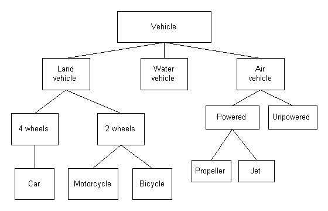

# L'héritage en C++

> [!NOTE]
> Ce cours vise à vous enseigner tous les aspects de l'héritage en C++, afin que vous puissiez écrire un code plus structuré, plus clair et plus facile à maintenir. Il est organisé en plusieurs chapitres, chacun dédié à l'explication un nouveau concept, accompagné d'un ou plusieurs exercices pratiques et de leurs solutions.

L'héritage est l'un des concepts fondamentaux de la programmation orientée objet, offrant une manière puissante de structurer et d'organiser son code.

En C++, l'héritage permet à une classe, appelée classe dérivée, d'hériter des attributs et des méhodes d'une autre classe, appelée classe de base ou classe parente.

Cette relation parent-enfant offre un moyen puissant de réutiliser du code, de promouvoir la modulabilité, tout en permettant la spécialisation et l'extension du code.

Voici la liste des chapitres de ce cours :
- [1. Introduction](chapter1/README.md)
- [2. Les méthodes virtuelles](chapter2/README.md)
- [3. Les types d'héritage (public, protected, private, virtual)](chapter3/README.md)
- [4. Notion diverses](chapter4/README.md)
